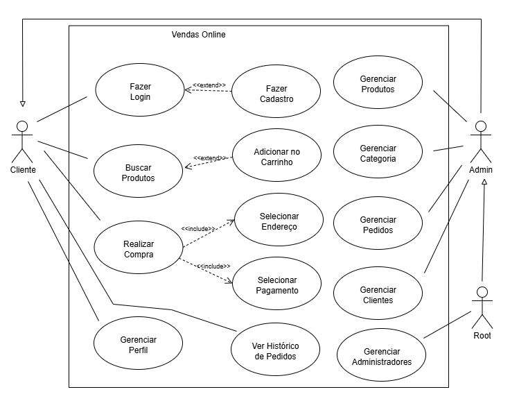

# 📱 Vendas Online - App

Este é o aplicativo mobile da plataforma **Vendas Online**, desenvolvido em **React Native** para oferecer uma experiência fluida e responsiva em dispositivos Android.

## 🚀 Principais Funcionalidades

O sistema foi projetado para ser uma solução completa de e-commerce.

### 🔐 Autenticação de Usuário
- Cadastro e login de usuários.

### 🛍️ Gerenciamento de Produtos e Categorias
- Exibição organizada de produtos por categoria.

### 🛒 Carrinho de Compras
- Adição, remoção e ajuste de quantidades de produtos.
- Carrinho persistente, mesmo ao fechar o app.

### 💳 Checkout e Pagamento
- Processo de checkout com seleção de endereço.
- Pagamentos via **PIX** ou **Cartão de Crédito**.

### 📦 Gerenciamento de Pedidos
- Visualização de histórico e detalhes de pedidos.

### 👤 Painel do Cliente
- Edição de dados pessoais.
- Alteração de senha.

## 📊 Diagrama de Caso de Uso



## 🎨 Protótipo no Figma

Você pode visualizar o protótipo completo no Figma clicando no link abaixo:

🔗 [Abrir no Figma](https://www.figma.com/design/RN03CQdT647qJtUM78c97y/Vendas-Online?node-id=0-1&t=nEpYvF2d7C3v1RsJ-1)

## 🛠️ Tecnologias Utilizadas

- **React Native CLI**: Framework para desenvolvimento mobile.
- **TypeScript**: Superset do JavaScript com tipagem estática.
- **Redux Toolkit**: Gerenciamento eficiente de estado global.
- **Axios**: Cliente HTTP para comunicação com o backend.
- **React Navigation**: Navegação entre telas.
- **Styled-components**: Estilização com escopo de componente.

## 📐 Arquitetura

- Estrutura modular por funcionalidades.
- Navegação organizada com **React Navigation**.
- Estado global centralizado com **Redux**.
- Uso de **hooks personalizados** (como `useRequests`) para requisições à API.
- Organização de código visando legibilidade e manutenibilidade.

## 🧹 Qualidade de Código

- **ESLint** e **Prettier** para padronização e qualidade.
- Regras específicas para **TypeScript** e **React Native**.

## ⚙️ Configuração do Ambiente

Antes de rodar o projeto, você precisa configurar o ambiente React Native.  
Escolha seu sistema operacional e siga os guias oficiais:

- 🖥️ [Guia para Windows](https://reactnative.dev/docs/set-up-your-environment?platform=android&os=windows)  
- 🍏 [Guia para macOS](https://reactnative.dev/docs/set-up-your-environment?platform=ios&os=macos)  
- 🐧 [Guia para Linux](https://reactnative.dev/docs/set-up-your-environment?platform=android&os=linux)  

> 💡 Use **Node.js LTS (18 ou superior)** e **JDK 17** para evitar problemas de compatibilidade.  
> 💡 No Android Studio, instale o SDK **Android 15 (VanillaIceCream - API 35)** e configure o AVD.

## ▶️ Executando o App

Após configurar o ambiente:

### 1️⃣ Instale as dependências:
```bash
npm install
```

### 2️⃣ Inicie o app no Android:
```bash
npx react-native run-android
```

O app será aberto no **emulador** do Android Studio ou em um **dispositivo físico** conectado via USB.  
